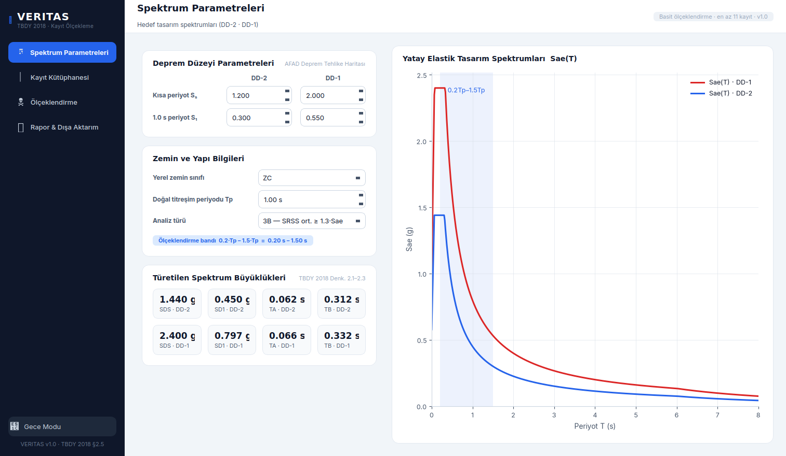
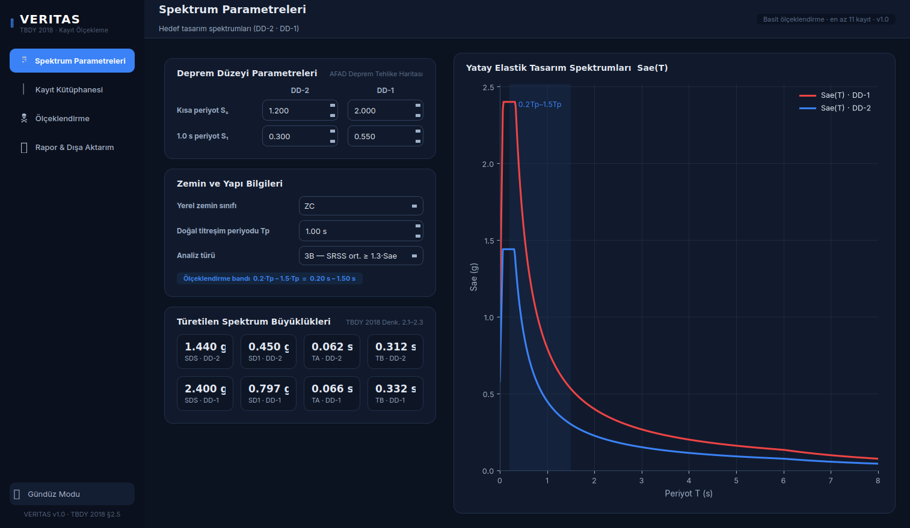

# VERITAS

**Deprem Kayıtlarının Seçimi ve Ölçeklendirilmesi · TBDY 2018 §2.5**

VERITAS, Türkiye Bina Deprem Yönetmeliği (TBDY 2018) Bölüm 2.5 kapsamında
zaman tanım alanında hesap için deprem kaydı seçimi ve basit (genlik)
ölçeklendirme sürecini uçtan uca yürüten bir PyQt6 masaüstü uygulamasıdır.
AFAD Deprem Tehlike Haritası parametrelerinden hedef tasarım spektrumunu
türetir, PEER NGA-West2 ivme kayıtlarını (.AT2) okuyup %5 sönümlü tepki
spektrumlarını hesaplar, yönetmeliğe göre ölçekleme katsayılarını bulur ve
sonuçları rapor olarak dışa aktarır.

<p align="center">
  
  
</p>

## İçindekiler

- [Özellikler](#özellikler)
- [Kurulum](#kurulum)
- [İş akışı](#iş-akışı)
- [Ölçeklendirme yöntemi](#ölçeklendirme-yöntemi)
- [Veri kaynağı](#veri-kaynağı)
- [Doğrulama ve denetimler](#doğrulama-ve-denetimler)
- [Proje yapısı](#proje-yapısı)

## Özellikler

- **Hedef spektrum:** Ss/S1 (DD-2, DD-1), yerel zemin sınıfı (ZA–ZE) ve
  yapı periyodu Tp'den SDS, SD1, TA, TB ve tasarım spektrumlarını anında
  türetir.
- **Kayıt kütüphanesi:** Boş açılır; bir PEER klasörünü tarayarak otomatik
  H1–H2 bileşen eşleştirmesiyle kendi kayıt takımlarınızı kurar, elle kayıt
  tanımlamaya da izin verir.
- **Ölçeklendirme motoru:** %5 sönümlü tepki spektrumu çözücüsü (frekans
  ortamında kesin çözüm) ve TBDY 2018 §2.5.2.5'e göre bireysel + grup
  katsayı hesabı.
- **Rapor & dışa aktarım:** Katsayı özet tablosu; CSV, 300 dpi PNG grafik
  ve ölçekli ivme serisi (TXT) çıktıları.
- **Gündüz/gece tema:** Tüm arayüz ve grafikler tek düğmeyle açık/koyu
  tema arasında geçiş yapar.

## Kurulum

Python 3.10 veya üzeri gerekir.

```bash
pip install -r requirements.txt
python VERITAS_TBDY2018_Olcekleme.py
```

`fonts/` klasörü uygulamanın kullandığı Inter yazı tiplerini içerir ve
`.py` dosyasıyla aynı dizinde kalmalıdır; klasör bulunamazsa uygulama
sistem yazı tipleriyle çalışmaya devam eder.

## İş akışı

Uygulama dört adımdan oluşur:

### 1) Spektrum parametreleri

AFAD Deprem Tehlike Haritası'ndan alınan Ss ve S1 değerlerini DD-2 ve
DD-1 için girin; yerel zemin sınıfını, yapının doğal titreşim periyodu
Tp'yi ve analiz türünü (2B/3B) seçin. SDS, SD1, TA, TB ve hedef
spektrumlar anında güncellenir.

### 2) Kayıt kütüphanesi

Kütüphane boş açılır — kendi veri setinizi yüklersiniz. "Kayıt
Klasörünü Tara" ile PEER'den indirilen `.AT2` dosyalarının bulunduğu
klasörü gösterin; program klasörü (alt klasörler dâhil) tarar ve
otomatik kayıt takımı kurar: dosyalar kayıt numarasına (RSN) göre
gruplanır, her gruptaki yatay bileşenlerden aralarındaki açı 90°'ye en
yakın olan çift H1–H2 olarak eşleştirilir, düşey bileşenler (`-UP`,
`DWN`, `UD`, `-V`, `-Z`) hesaba katılmaz.

Desteklenen azimut biçimleri: `225/315`, `002/092`, `N76W/S14W`,
`NS/EW`, `L/T`. Mw, uzaklık ve Vs30 bilgisi `.AT2` dosyalarında
bulunmadığından otomatik eklenen kayıtlarda `—` görünür; tablo
satırına çift tıklayarak bu bilgileri girebilir veya dosyaları
değiştirebilirsiniz. "Kayıt Ekle" ile elle de kayıt takımı
tanımlanabilir.

### 3) Ölçeklendirme

"Hesapla" (F5): %5 sönümlü tepki spektrumları hesaplanır ve TBDY
2018 §2.5.2.5'e göre basit (genlik) ölçeklendirme yapılır. Grafik
sekmeleri ölçeksiz/ölçekli spektrumları, katsayı çubuklarını ve
ölçekli ivme serilerini gösterir.

### 4) Rapor & dışa aktarım

Katsayı özeti tablosu ekranda görüntülenir; CSV (katsayılar,
spektrumlar), 300 dpi PNG grafikler ve ölçekli ivme serileri (TXT,
t–a sütunları, g biriminde) dışa aktarılabilir.

## Ölçeklendirme yöntemi

TBDY 2018 §2.5.2.5 basit ölçeklendirmesi üç katsayıdan oluşur:

- **Bireysel katsayı f** — her kayıt için hedef spektruma en küçük
  kareler uyumu.
- **Grup katsayısı g** — ortalama spektrumun, 0.2·Tp – 1.5·Tp
  bandının her noktasında hedefin altına düşmemesini sağlar.
- **Nihai katsayı F = f × g** — DD-2 ve DD-1 için ayrı ayrı hesaplanır.

Hedef ölçüt: 3B analizde SRSS ortalaması ≥ 1.3·Sae(T), 2B analizde
bileşen ortalaması ≥ 1.0·Sae(T).

## Veri kaynağı

İvme kayıtları (`.AT2`) [PEER NGA-West2](https://ngawest2.berkeley.edu/)
veritabanından indirilmelidir (kurumsal e-posta ile üyelik gerekir;
indirilenler ham ve ölçeksizdir). Gerekirse Japonya kayıtları için
[K-NET/KiK-net](https://www.kyoshin.bosai.go.jp/), Yeni Zelanda
kayıtları için [GeoNet](https://www.geonet.org.nz/) kullanılabilir.

## Doğrulama ve denetimler

- `.AT2` dosyaları PEER NGA biçiminde ve g biriminde olmalıdır.
- TBDY §2.5.1 denetimleri programda izlenir: en az 11 kayıt takımı ve
  aynı depremden en fazla 3 kayıt; aykırılıklar uyarı olarak gösterilir.
- Tepki spektrumu çözücüsü, bağımsız Nigam–Jennings ve ince adımlı
  Newmark çözümleriyle %0.3'ten iyi uyumla doğrulanmıştır.

## Proje yapısı

```
VERITAS_TBDY2018_Olcekleme.py   Uygulama (arayüz + TBDY 2018 motoru)
fonts/                          Inter Regular / Medium / Bold
BENIOKU.txt                     Kurulum ve iş akışı kılavuzu (Türkçe)
requirements.txt                PyQt6, numpy, matplotlib
```
